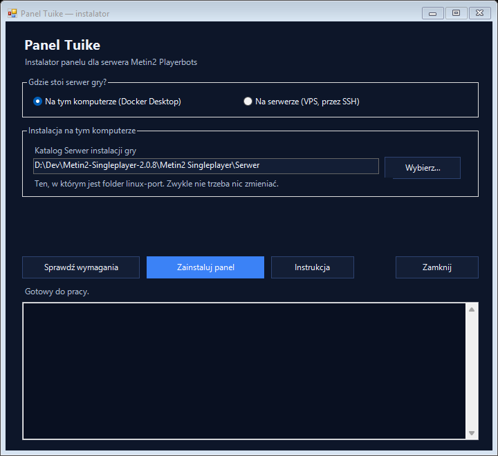
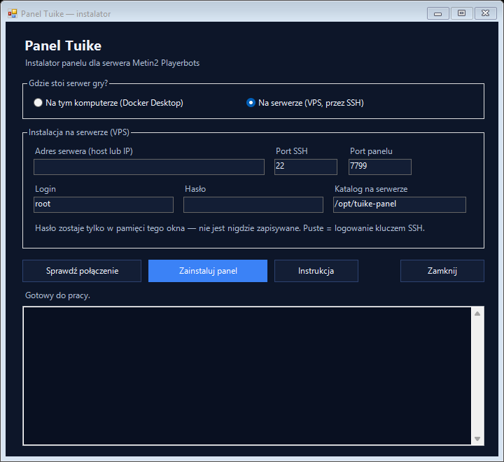

# Panel Tuike — instalacja

Tuike to panel administracyjny do serwera Metin2 z Playerbotami: mapa świata na
żywo, karty postaci z ekwipunkiem, rankingi, gospodarka straganów, sterowanie
mnożnikami i zachowaniem botów, moderacja kont i strona dla graczy.

Panel dokłada się do już działającego serwera. Nie zmienia gry, nie dotyka bazy
poza własnymi tabelami (`web_tuike_*`) i nie podmienia żadnego pliku serwera.

---

## 1. Zanim zaczniesz

Potrzebujesz trzech rzeczy:

1. **Działającego serwera Metin2 Playerbots** — panel podłącza się do jego bazy
   i sieci, więc serwer musi być uruchomiony choć raz przed instalacją.
2. **Dockera** na maszynie, gdzie stoi serwer (na VPS zwykle już jest; na
   Windowsie — Docker Desktop).
3. **Windowsa z PowerShellem** do uruchomienia instalatora. To wszystko, co
   robisz ręcznie.

Jeśli serwer stoi na zdalnej maszynie (VPS), potrzebujesz też dostępu po SSH —
tego samego, którym się na nią logujesz.

---

## 2. Gdzie położyć folder

**Folder `tuike-panel` musi leżeć w katalogu `Serwer`**, obok `linux-port`:

```
Serwer/
  linux-port/
  launcher/
  tuike-panel/        <- tutaj
    Zainstaluj-Tuike-GUI.bat
    instrukcja.md
```

Instalator sam sprawdza, czy leży we właściwym miejscu, i mówi, co poprawić.
Z tego położenia odczytuje ustawienia serwera — adres bazy, hasło i nazwę
instalacji — więc niczego nie musisz przepisywać ręcznie.

---

## 3. Instalacja w oknie (zalecana)

Kliknij dwa razy **`Zainstaluj-Tuike-GUI.bat`**. Otworzy się okno:



Na górze wybierasz, gdzie stoi serwer gry.

### Serwer na tym komputerze

Wskaż **katalog `Serwer`** swojej instalacji gry — ten, w którym jest folder
`linux-port`. Instalator wpisuje go sam; przycisk **Wybierz…** przyda się, gdy
masz na dysku kilka instalacji.

### Serwer na VPS



Wypełniasz pięć pól:

| Pole | Co wpisać | Domyślnie |
| --- | --- | --- |
| **Adres serwera** | IP albo domena Twojego VPS-a | — |
| **Port SSH** | port, na którym słucha SSH | `22` |
| **Login** | użytkownik, na którego się logujesz (`root`, `debian`…) | `root` |
| **Hasło** | hasło tego użytkownika; zostaw puste, jeśli logujesz się kluczem | — |
| **Katalog na serwerze** | gdzie położyć pliki panelu | `/opt/tuike-panel` |

Możesz też ustawić **port panelu** (domyślnie 7799) — pod nim panel będzie
dostępny w przeglądarce.

Hasło zostaje tylko w pamięci okna: nie trafia do żadnego pliku ani do linii
poleceń, którą widać na liście procesów. Jeśli łączysz się z tym serwerem po
raz pierwszy, instalator przyjmie jego klucz (tak jak `ssh` przy pierwszym
logowaniu).

### Dwa przyciski

- **Sprawdź połączenie / Sprawdź wymagania** — nic nie instaluje, tylko mówi,
  czy wszystko jest na miejscu. Dobrze zacząć od tego.
- **Zainstaluj panel** — wysyła panel i uruchamia go. Przebieg widać w oknie na
  dole; pierwsza instalacja trwa kilka minut, bo budowany jest obraz panelu.

Na końcu w logu pojawi się adres panelu, zwykle `http://ADRES-SERWERA:7799`.
Jeśli port jest zajęty, instalator wybierze pierwszy wolny i o tym napisze.

---

## 3b. Instalacja bez okna

Ten sam instalator działa z linii poleceń — przydaje się, gdy robisz to zdalnie
albo chcesz mieć wszystko w jednym poleceniu:

```powershell
# sprawdzenie bez instalowania — nic nie zostanie zmienione
.\Zainstaluj-Tuike.ps1 -Sprawdz

# instalacja na zdalnym serwerze
.\Zainstaluj-Tuike.ps1 -Tryb vps -VpsHost 1.2.3.4 -VpsPort 22 -VpsUser debian

# instalacja lokalna na wskazanym porcie
.\Zainstaluj-Tuike.ps1 -Tryb lokalny -Port 7801
```

Bez podanego hasła logowanie idzie kluczem SSH. Żeby użyć hasła, wpisz je
wcześniej do zmiennej `TUIKE_SSH_PASSWORD` — dokładnie to robi okienko.

---

## 4. Co instalator robi, a czego nie

**Robi:**

- tworzy **osobny projekt Dockera** o nazwie `tuike-panel` z trzema
  kontenerami: panel, kolektor statystyk i worker nadawania przedmiotów;
- podłącza je do sieci i wolumenów Twojego serwera jako **zasobów zewnętrznych**
  — czyta pliki świata tylko do odczytu;
- zapisuje konfigurację w `tuike.env` (na serwerze: `/opt/tuike-panel/tuike.env`),
  z prawami `600`, bo jest tam hasło do bazy;
- ustawia **automatyczny start**: kontenery mają `restart: unless-stopped`, a na
  Linuksie dochodzi usługa `tuike-panel` w systemd.

**Nie robi:**

- nie zmienia `docker-compose.yml` Twojego serwera ani żadnego innego jego
  pliku — dlatego aktualizacja serwera nie usunie panelu;
- nie tworzy, nie kasuje i nie czyści wolumenów z bazą i światem gry;
- nie restartuje gry ani nie rozłącza graczy;
- nie wysyła niczego na zewnątrz poza jednym zapytaniem do GitHuba raz na
  15 minut (sprawdzenie, czy jest nowsze wydanie Playerbotów). Wyłączysz to,
  wpisując `TUIKE_UPDATE_CHECK=0` w `tuike.env`.

---

## 5. Pierwsze kroki po instalacji

1. Otwórz panel w przeglądarce.
2. Wejdź w **Zarządzanie → Wygląd i dostęp** i **włącz ochronę hasłem**.
   Świeży panel jest otwarty dla każdego, kto zna adres — to wygodne przy
   instalacji na własnym komputerze i niebezpieczne na VPS-ie z publicznym IP.
3. Tam samo ustawisz nazwę panelu, motyw i — jeśli chcesz — **stronę dla graczy**
   pod adresem `/serwer` (stan serwera, rankingi i ceny na straganach, bez
   logowania). Domyślnie jest wyłączona.

Statystyki historyczne (wykresy gospodarki, aktywność map, telemetria) zaczną
się wypełniać po kilku-kilkunastu minutach — tyle trwa, zanim kolektor zapisze
pierwsze odczyty.

---

## 6. Automatyczny start

Panel wstaje razem z serwerem sam, bez żadnej dodatkowej konfiguracji:

- **Docker** podnosi kontenery panelu przy każdym starcie (po restarcie
  maszyny, po starcie Docker Desktop) — dzięki `restart: unless-stopped`.
- **Linux z systemd** dostaje dodatkowo usługę `tuike-panel`:

```bash
sudo systemctl status tuike-panel     # czy działa
sudo systemctl stop tuike-panel       # zatrzymaj panel
sudo systemctl start tuike-panel      # włącz panel
sudo systemctl disable tuike-panel    # nie startuj razem z maszyną
```

Zatrzymanie serwera gry nie zatrzymuje panelu — panel pokaże wtedy „Serwer nie
odpowiada” i będzie czekał, aż gra wróci.

---

## 7. Aktualizacja panelu

Uruchom instalator jeszcze raz. Zbuduje nowszą wersję i podmieni kontenery.
Ustawienia panelu przeżywają aktualizację, bo siedzą w bazie, a klucz sesji —
w `tuike.env`, więc nikt nie zostanie wylogowany.

---

## 8. Odinstalowanie

Na serwerze (Linux):

```bash
sudo systemctl disable --now tuike-panel
cd /opt/tuike-panel
sudo docker compose --env-file tuike.env -f install/docker-compose.tuike.yml down
sudo rm -rf /opt/tuike-panel /etc/systemd/system/tuike-panel.service
```

Lokalnie (Windows, w folderze `tuike-panel`):

```powershell
docker compose --env-file .instalacja\tuike.env -f install\docker-compose.tuike.yml down
```

`down` na projekcie panelu **nie rusza** bazy ani świata gry: te wolumeny należą
do serwera i są podpięte jako zewnętrzne.

Tabele `web_tuike_*` zostają w bazie — same nic nie robią i zajmują tyle, ile
zebrana historia. Jeśli chcesz je usunąć, skasuj ręcznie tabele o tym prefiksie.

---

## 9. Kiedy coś nie działa

| Komunikat | Co zrobić |
| --- | --- |
| `Folder tuike-panel lezy w ...` | Przenieś cały folder do katalogu `Serwer`. |
| `Nie ma polecenia docker` | Zainstaluj i uruchom Docker Desktop (Windows) albo Dockera na serwerze. |
| `nie ma sieci ..._backend` | Uruchom najpierw serwer gry — sieć i wolumeny powstają przy jego pierwszym starcie. |
| `w .env nie ma M2_DB_PASSWORD` | Serwer nie był jeszcze skonfigurowany. Uruchom go raz przez własny instalator/launcher. |
| `Nie moge zalogowac sie na ...` | Zły adres, port, login albo hasło. Sprawdź, czy tym samym loginem wchodzisz przez `ssh` z wiersza poleceń. |
| `Brakuje ssh lub scp` | Windows: Ustawienia → Aplikacje → Funkcje opcjonalne → dodaj **Klient OpenSSH**. |
| Panel otwiera się, ale mówi „Serwer nie odpowiada” | Gra jest zatrzymana albo wstaje. Panel sam wróci do normy, gdy gra ruszy. |
| Puste wykresy i zero historii | Kolektor zapisuje odczyty co kilka minut — daj mu kwadrans. |

Logi panelu na serwerze:

```bash
cd /opt/tuike-panel
sudo docker compose --env-file tuike.env -f install/docker-compose.tuike.yml logs -f tuike
```

---

## 10. Bezpieczeństwo w trzech zdaniach

Panel ma pełną władzę nad postaciami i kontami: nadaje przedmioty, zmienia
poziomy, blokuje konta i resetuje hasła. Na maszynie z publicznym adresem
**włącz ochronę hasłem od razu po instalacji**, a najlepiej dodatkowo ogranicz
port panelu zaporą do własnego adresu IP. Plik `tuike.env` zawiera hasło do
bazy — nie wysyłaj go nikomu i nie wrzucaj do repozytorium.
